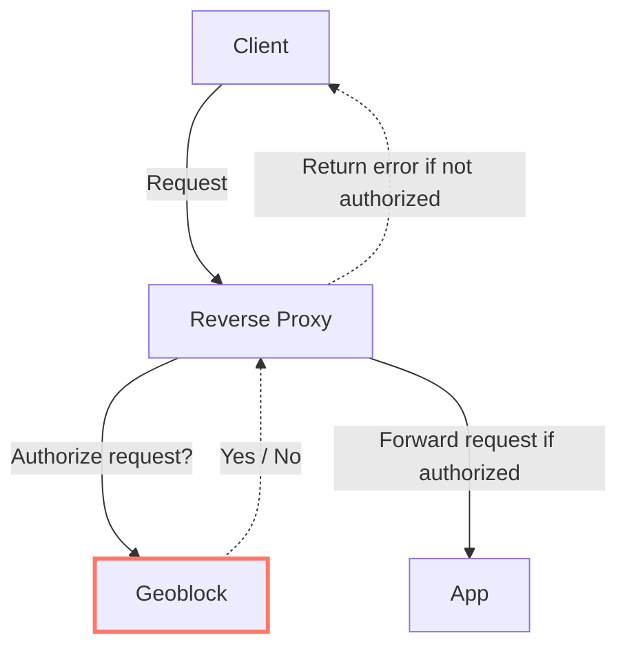
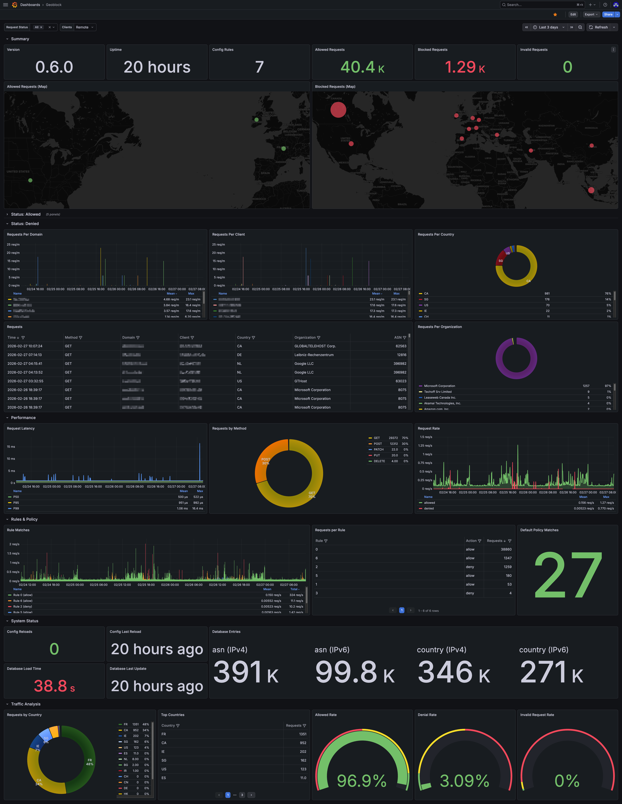

<!-- markdownlint-disable MD033 -->
<h1 align="center">Geoblock</h1>
<!-- markdownlint-enable MD033 -->

Forward authentication service for geoblocking. Restricts access based on country, ASN,
IP network, domain, and HTTP method. Integrates with Traefik, NGINX, and Caddy as a
forward auth middleware.

## Contents <!-- omit from toc -->

- [Quick Start](#quick-start)
- [How It Works](#how-it-works)
- [Configuration](#configuration)
- [Environment Variables](#environment-variables)
- [HTTP API](#http-api)
  - [`GET /v1/forward-auth`](#get-v1forward-auth)
  - [`GET /v1/health`](#get-v1health)
  - [`GET /metrics`](#get-metrics)
- [Reverse Proxy Examples](#reverse-proxy-examples)
- [Monitoring](#monitoring)
- [Attribution](#attribution)

## Quick Start

Create a `config.yaml`:

```yaml
---
access_control:
  default_policy: deny
  rules:
    # Allow from private networks
    - networks:
        - 10.0.0.0/8
        - 172.16.0.0/12
        - 192.168.0.0/16
      policy: allow

    # Allow from France
    - countries:
        - FR
      policy: allow
```

Create a `compose.yaml`:

```yaml
---
services:
  geoblock:
    image: ghcr.io/danroc/geoblock:latest
    volumes:
      - ./config.yaml:/config.yaml
      - geoblock-cache:/cache

volumes:
  geoblock-cache:
```

Then configure your reverse proxy to use `http://geoblock:8080/v1/forward-auth` as a
forward auth endpoint. See [Reverse Proxy Examples](#reverse-proxy-examples) for
complete setups.

## How It Works

Geoblock runs alongside your reverse proxy. When a request arrives, the proxy forwards
it to Geoblock for authorization. Geoblock resolves the client's IP to a country and
ASN, evaluates the configured rules, and allows or denies the request.


```mermaid
flowchart TD
  Client
  Proxy["Reverse Proxy"]
  App
  Geoblock

  Client --->|Request| Proxy
  Proxy --->|Authorize request?| Geoblock
  Geoblock -..->|Yes / No| Proxy
  Proxy -..->|Return error if not authorized| Client
  Proxy --->|Forward request if authorized| App

  style Geoblock stroke:#f76,stroke-width:3px
```

IP geolocation data is sourced from [ip-location-db] and updated automatically. The
configuration file is watched for changes and reloaded when modified.

## Configuration

Rules are evaluated in order; the first match wins. If no rule matches, the
`default_policy` applies. A rule matches when all of its conditions are satisfied.
Available conditions:

- `countries`: List of country codes ([ISO 3166-1 alpha-2][country-codes])
- `domains`: List of domain names (supports `*` wildcard, e.g., `*.example.com`)
- `methods`: List of HTTP methods (`GET`, `HEAD`, `POST`, `PUT`, `DELETE`, `PATCH`)
- `networks`: List of IP ranges in CIDR notation
- `autonomous_systems`: List of ASNs

Example configuration file:

```yaml
---
access_control:
  # Default action when no rules match ("allow" or "deny").
  default_policy: deny

  # List of access rules, evaluated in order. The first matching rule's
  # policy is applied. If no rule matches, the default policy is used.
  #
  # IMPORTANT: Replace these example rules with your own rules.
  rules:
    # Allow access from internal/private networks.
    - networks:
        - 10.0.0.0/8
        - 127.0.0.0/8
        - 172.16.0.0/12
        - 192.168.0.0/16
      policy: allow

    # Deny access for clients from ASNs 1234 and 5678.
    - autonomous_systems:
        - 1234
        - 5678
      policy: deny

    # Allow access to any domain from clients in Germany (DE).
    - countries:
        - DE
      policy: allow

    # Allow access to example.com and example.org from clients in
    # France (FR) and the United States (US) using the GET or POST HTTP
    # methods.
    - domains:
        - example.com
        - example.org
      countries:
        - FR
        - US
      methods:
        - GET
        - POST
      policy: allow

    # Allow access to all subdomains of example.com using wildcard.
    - domains:
        - "*.example.com"
      policy: allow
```

## Environment Variables

| Variable               | Description                    | Docker default |
| :--------------------- | :----------------------------- | :------------- |
| `GEOBLOCK_CACHE_DIR`   | Path to IP database cache      | `/cache`       |
| `GEOBLOCK_CONFIG_FILE` | Path to the configuration file | `/config.yaml` |
| `GEOBLOCK_PORT`        | Port to listen on              | `8080`         |
| `GEOBLOCK_LOG_LEVEL`   | Log level                      | `info`         |
| `GEOBLOCK_LOG_FORMAT`  | Log format (`json` or `text`)  | `json`         |

<!-- prettier-ignore -->
> [!NOTE]
> The standalone binary defaults to `/var/cache/geoblock` for cache and
> `/etc/geoblock/config.yaml` for configuration.

Set `GEOBLOCK_CACHE_DIR` to an empty string to disable caching. Accepted log levels:
`trace`, `debug`, `info`, `warn`, `error`, `fatal`, `panic`.

## HTTP API

### `GET /v1/forward-auth`

Check if a client is authorized to access a domain.

**Request:**

| Header               | Required | Description           |
| :------------------- | :------: | :-------------------- |
| `X-Forwarded-For`    |   Yes    | Client's IP address   |
| `X-Forwarded-Host`   |   Yes    | Requested domain      |
| `X-Forwarded-Method` |   Yes    | Requested HTTP method |

**Response:**

| Status | Description |
| :----- | :---------- |
| `204`  | Authorized  |
| `400`  | Bad request |
| `403`  | Forbidden   |

### `GET /v1/health`

Check if the service is healthy.

**Response:**

| Status | Description |
| :----- | :---------- |
| `204`  | Healthy     |

### `GET /metrics`

Returns metrics in Prometheus format.

## Reverse Proxy Examples

Complete Docker Compose examples:

- [Traefik](./examples/traefik/)
- [Caddy](./examples/caddy/)
- [NGINX](./examples/nginx/)

## Monitoring

**Dashboard:** [grafana/dashboard.json](./grafana/dashboard.json)



## Attribution

IP geolocation data is sourced from the [ip-location-db] project, which packages
[GeoLite2] data provided by [MaxMind].

[geolite2]: https://dev.maxmind.com/geoip/geolite2-free-geolocation-data/
[maxmind]: https://www.maxmind.com/
[ip-location-db]: https://github.com/sapics/ip-location-db
[country-codes]: https://www.iban.com/country-codes
