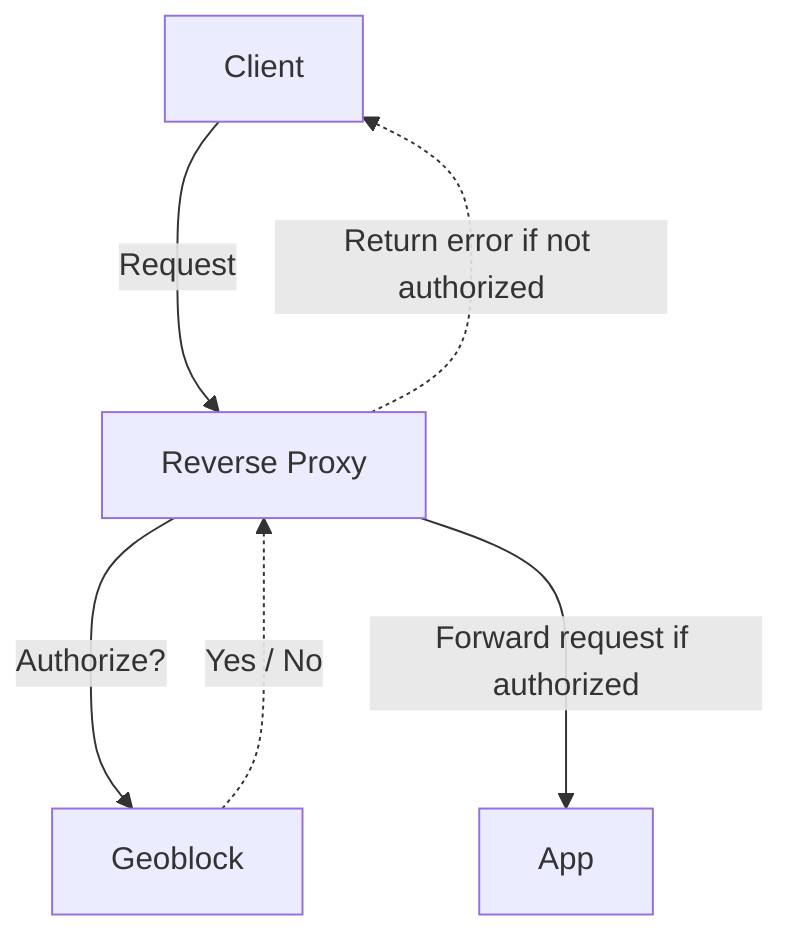

<!-- markdownlint-disable MD033 -->
<h1 align="center">Geoblock</h1>
<p align="center">
  <i>Block clients based on their country, ASN, or network.</i>
</p>

<details>
<summary><b>Table of contents</b></summary>
<p>

- [Introduction](#introduction)
- [Features](#features)
- [Deployment](#deployment)
- [Configuration](#configuration)
- [Environment variables](#environment-variables)
- [HTTP API](#http-api)
  - [`GET /v1/forward-auth`](#get-v1forward-auth)
  - [`GET /v1/health`](#get-v1health)
  - [`GET /v1/metrics`](#get-v1metrics)
- [Attribution](#attribution)

</p>
</details>
<!-- markdownlint-enable MD033 -->

## Introduction

Geoblock is a lightweight authorization service that restricts client access
based on:

- Client's country
- Client's IP address
- Client's ASN (Autonomous System Number)
- Requested domain
- Requested method

It works as a forward-authentication service that can be used with reverse
proxies such as Traefik, NGINX, and Caddy.

## Features

- **Flexible:** Allows you to define access control rules based on
  countries, domains, methods, networks, and ASNs.

- **Auto-reload:** Automatically reloads the configuration file when it
  changes.

- **Auto-update:** Automatically updates the GeoLite2 databases every day.

- **Metrics:** Exposes simple metrics to monitor the service and build
  dashboards.

## Deployment

Geoblock should be deployed as a forward authentication service that integrates
with your existing reverse proxy.



**Examples:**

- [Example using Traefik](./examples/traefik/README.md)
- [Example using Caddy](./examples/caddy/README.md)
- [Example using NGINX](./examples/nginx/README.md)

## Configuration

Geoblock uses a single configuration file (`/etc/geoblock/config.yaml` by
default) to set access control rules. Rules are evaluated sequentially,
applying the first match per request. If no rules match, the default policy
applies.

A rule matches if all specified conditions are met. Rules can include one or
more of the following criteria:

- `countries`: List of country codes ([ISO 3166-1 alpha-2](https://www.iban.com/country-codes))
- `domains`: List of domain names
- `methods`: List of HTTP methods
- `networks`: List of IP ranges in CIDR notation
- `autonomous_systems`: List of ASNs

Example configuration file:

```yaml
---
access_control:
  # Default action when no rules match ("allow" or "deny").
  default_policy: deny

  # List of access rules, evaluated in order. The first matching rule’s
  # policy is applied. If no rule matches, the default policy is used.
  #
  # IMPORTANT: Replace these example rules with your own rules.
  rules:
    # Allow access from internal/private networks.
    - networks:
        - 10.0.0.0/8
        - 127.0.0.0/8
        - 172.16.0.0/12
        - 192.168.0.0/16
      policy: allow

    # Deny access for clients from ASNs 1234 and 5678.
    - autonomous_systems:
        - 1234
        - 5678
      policy: deny

    # Allow access to any domain from clients in Germany (DE).
    - countries:
        - DE
      policy: allow

    # Allow access to example.com and example.org from clients in
    # France (FR) and the United States (US) using the GET or POST HTTP
    # methods.
    - domains:
        - example.com
        - example.org
      countries:
        - FR
        - US
      methods:
        - GET
        - POST
      policy: allow
```

## Environment variables

> [!NOTE]
> Environment variables are intended primarily to be used when running Geoblock
> locally during development. It is discouraged to set or modify their values
> when running the Docker image. Instead, use mounts or remap ports as needed.

The following environment variables can be used to configure Geoblock:

| Variable             | Description                    | Default                     |
| :------------------- | :----------------------------- | :-------------------------- |
| `GEOBLOCK_CONFIG`    | Path to the configuration file | `/etc/geoblock/config.yaml` |
| `GEOBLOCK_PORT`      | Port to listen on              | `8080`                      |
| `GEOBLOCK_LOG_LEVEL` | Log level                      | `info`                      |

Supported log levels are: `trace`, `debug`, `info`, `warn`, `error`, `fatal`,
or `panic`.

## HTTP API

The following HTTP endpoints are exposed by Geoblock.

### `GET /v1/forward-auth`

Check if a client is authorized to access a domain.

**Request:**

| Header               | Required | Description           |
| :------------------- | :------: | :-------------------- |
| `X-Forwarded-For`    |   Yes    | Client's IP address   |
| `X-Forwarded-Host`   |   Yes    | Requested domain      |
| `X-Forwarded-Method` |   Yes    | Requested HTTP method |

**Response:**

| Status | Description |
| :----- | :---------- |
| `204`  | Authorized  |
| `403`  | Forbidden   |

### `GET /v1/health`

Check if the service is healthy.

**Response:**

| Status | Description |
| :----- | :---------- |
| `204`  | Healthy     |

### `GET /v1/metrics`

Returns metrics in JSON format.

**Response:**

- MIME type: `application/json`

- Properties:

  - `version`: Application version string
  - `requests`: Object containing request count metrics
    - `allowed`: Number of allowed requests
    - `denied`: Number of denied requests
    - `invalid`: Number of invalid requests
    - `total`: Total number of requests

- Example:

  ```json
  {
    "version": "1.0.0",
    "requests": {
      "allowed": 3,
      "denied": 2,
      "invalid": 1,
      "total": 6
    }
  }
  ```

## Attribution

- This project uses the [GeoLite2][geolite2] databases provided by
  [MaxMind][maxmind].

- This project uses the database files provided by the
  [ip-location-db][ip-location-db] project.

[geolite2]: https://dev.maxmind.com/geoip/geolite2-free-geolocation-data/
[maxmind]: https://www.maxmind.com/
[ip-location-db]: https://github.com/sapics/ip-location-db
